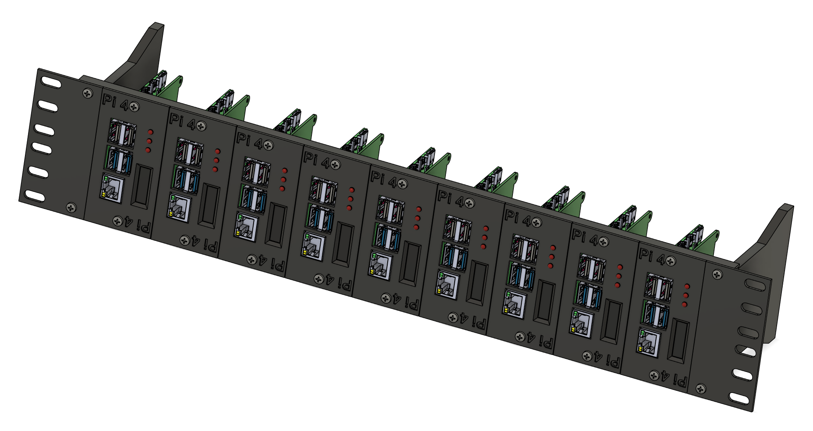

# Pi Blade

## Description
A complete 2U blade mounting system for Raspberry Pi 1B/3/3B,4B, and 5.  Includes 2U rail mount and blades remixed from the work done by Krapozok on [Thingiverse](https://www.thingiverse.com/thing:1793758).

The lights are based on RagnarJensen's [PiLEDLights](https://github.com/RagnarJensen/PiLEDlights) project with the Wiring Pi dependency removed.  

OLED display is a work in progress.

---

---