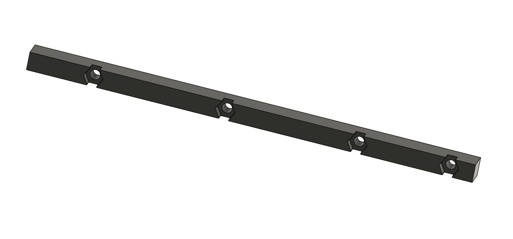
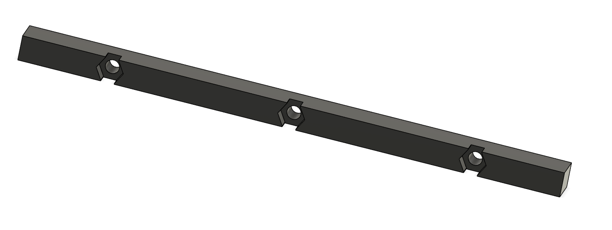
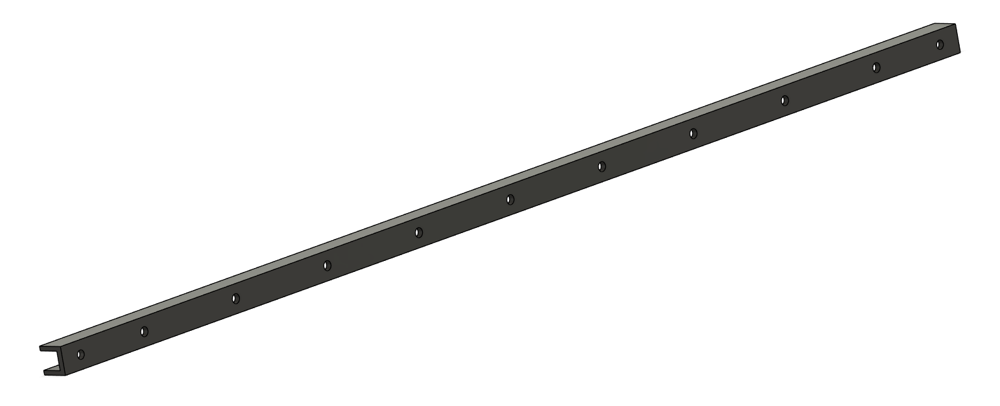

# Rack Mount System

## Description
2U blade style mouting system for the Raspberry Pi

## BOM
- 2x Rack Ears (3d Printed)
- 1x [1/16 in. X 1/2 in. W X 48 in. L Anodized Aluminum Trim Channel](https://www.acehardware.com/departments/hardware/angles-braces-and-brackets/metal-angles/5044644)
- 4x Outside Nut Shim (3d Printed)
- 2x Center Nut Shim (3d Printed)
- 22x 3x6mm bolt
- 11x 3mm nut

## Assembly
Cut aluminum trim channel into two 17" pieces.  I used a CNC machine to drill the holes with precise spacing.  Alternatively you could glue in the center and outside nut shims and use them as a guide to drill the 3.2mm clearance holes.\
\
Lay nut shims in place and add nuts to the indents.  Fasten tight with bolts and lightly epoxy the nuts in place, taking care not to get any on the bolt threads.\
\
Add rack ears to the ends of the rails and you're ready to mount in your rack.

## Parts
Rack Ears\

Outside Nut Shim\

Center Nut Shim\

Rails\

## Blade Inserts

